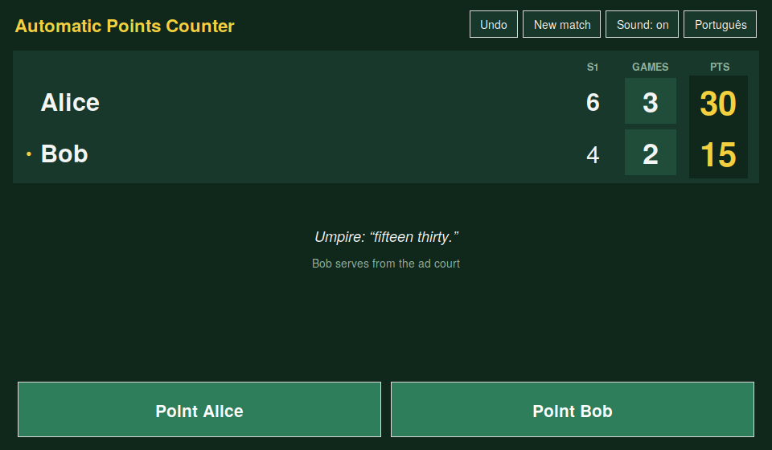
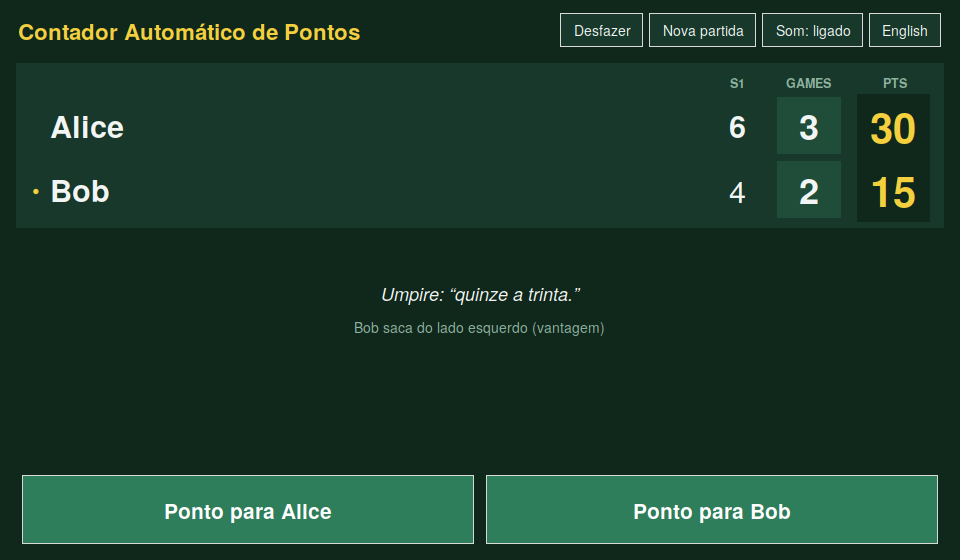
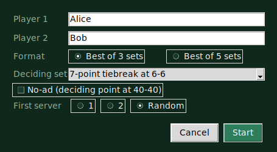
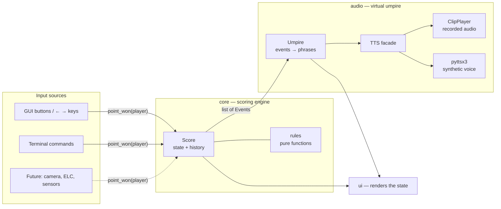
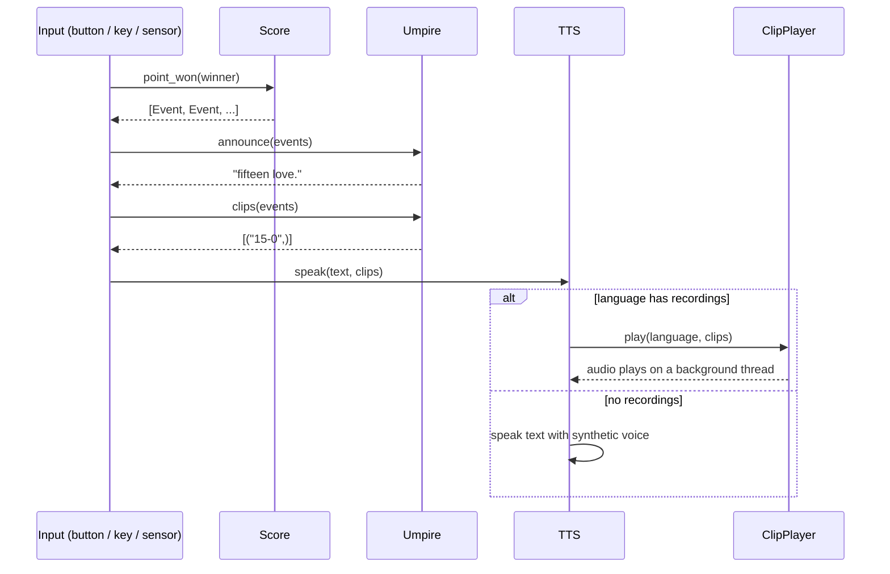

<div align="center">

# 🎾 Automatic Points Counter

### A tennis scorekeeper that counts, tracks and *announces* the score — so the chair umpire can focus on what machines can't judge.




</div>

---

## 📑 Table of contents

1. [Overview](#-overview)
2. [Why this project exists](#-why-this-project-exists)
3. [Features](#-features)
4. [What is automated — and what is not](#-what-is-automated--and-what-is-not)
5. [Getting started](#-getting-started)
6. [The umpire's voice](#-the-umpires-voice)
7. [Architecture](#-architecture)
8. [Tech stack](#-tech-stack)
9. [Extending the project](#-extending-the-project)
10. [Roadmap](#-roadmap)
11. [Testing](#-testing)
12. [License](#-license)

---

## 🔭 Overview

**Automatic Points Counter** is a complete tennis scoring engine with a scoreboard interface and a virtual umpire that *speaks* the score after every point, exactly as a chair umpire would ("fifteen love", "deuce", "advantage", "game and first set…").

It implements the scoring rules of professional tennis end to end — games, deuce and advantage, no-ad, tiebreaks, match tiebreaks, five different deciding-set formats, the serving order, the court side the server must use and the changes of ends — and it does so as a **clean, UI-independent engine** that anything can drive: a button, a keyboard, a terminal… or, in the future, a camera or an electronic line-calling system.

> **Current status:** points are registered by the scorer (on-screen buttons, `←` / `→` keys, or the terminal). The architecture is deliberately built so that a *sensor* can take over that role — see [Extending the project](#-extending-the-project).

---

## 💡 Why this project exists

Professional tennis has been steadily replacing human line judges with **Electronic Line Calling (ELC)** systems such as Hawk-Eye Live: the ball is tracked by cameras and the call "out!" is made automatically, instantly and consistently.

That raised a natural question:

> *If the machine can already tell whether the ball was out, why is the **score** still tracked by hand?*

Scorekeeping is purely rule-based and deterministic — the ideal job for software. This project takes that idea to its conclusion: **automate everything that is mechanical, and leave to humans everything that requires judgment.**

---

## ✨ Features

### 🏆 Complete scoring engine
- **Points** — 0, 15, 30, 40, with **deuce** and **advantage**.
- **No-ad scoring** — a single deciding point at 40-40.
- **Games and sets** — 6 games with a 2-game margin, with the correct handling of 7-5 and 7-6.
- **Tiebreaks** — 7-point and 10-point tiebreaks, win-by-two.
- **Match formats** — best of **1, 3 or 5** sets (1 is available from the command line).
- **Five deciding-set formats**, selectable per match:

  | Format | Rule |
  |---|---|
  | `tiebreak7` | 7-point tiebreak at 6-6 *(default, ATP/WTA)* |
  | `tiebreak10` | 10-point tiebreak at 6-6 |
  | `tiebreak7_12` | 7-point tiebreak at 12-12 |
  | `advantage` | No tiebreak — win by 2 games |
  | `match_tiebreak` | 10-point match tiebreak in place of the set |

### 🎯 Court awareness
- **Server tracking** — who serves, with automatic rotation every game.
- **Tiebreak serving pattern** — one serve for the first server, then two each, alternating.
- **Serve court side** — shows whether the server serves from the *deuce* or *ad* court.
- **Changes of ends** — flagged after the 1st, 3rd, 5th… game of a set, and every 6 points in a tiebreak.

### 🗣️ Virtual umpire
- Announces **points, deuce, advantage, deciding point, tiebreak points, games, sets and the final result**.
- Scores are read **server-first**, as a real umpire does ("thirty fifteen" = server 30, receiver 15).
- Plays **recorded human voice** when recordings exist for the language (Brazilian Portuguese today), and falls back to a **synthetic voice** otherwise.
- Phrases are **data, not code**: every call lives in an editable JSON file per language.

### 🖥️ Two interfaces
- **Graphical scoreboard** (Tkinter) with a dark-green tournament look, big point buttons and live status.
- **Terminal mode** for headless use, quick tests and automation.

### 🌍 Bilingual, live
- Full interface in **English and Brazilian Portuguese**, switchable **at any time during a match** — player names, the last umpire call and notices are re-translated instantly. Names you typed yourself are preserved.

### ↩️ Unlimited undo
- Every point is snapshotted, so a wrong click (or an umpire correction) can be reverted — all the way back to 0-0 — restoring the score, the server and the court side.

<div align="center">

| English | Português |
|:---:|:---:|
|  |  |

</div>

---

## 🤝 What is automated — and what is not

The goal is **not** to replace the chair umpire. It is to remove the arithmetic and bookkeeping so the umpire can do the part of the job that actually needs a human.

| 🤖 Handled by the software | 🧑‍⚖️ Remains with the chair umpire |
|---|---|
| Point, game, set and match arithmetic | Answering **player queries** and disputed calls |
| Deuce, advantage and no-ad logic | Calling a **hindrance** (deliberate or accidental) |
| Tiebreak triggers, serving order and court side | **Code violations** — time, racquet abuse, unsportsmanlike conduct |
| Reminders for changes of ends | **Let** and replay decisions |
| Consistent, clear score announcements (multilingual) | **Overrules** and rule interpretation |
| Instant correction through undo | Medical timeouts, suspensions, special circumstances |

**Benefits**

- ✅ **Fewer scoring errors** — no more forgotten servers, wrong sides or lost points.
- ✅ **Consistency** — the score is called the same way, every time, in every language.
- ✅ **Attention where it matters** — the umpire watches the match, not the counter.
- ✅ **Useful at every level** — from a club match without an umpire to a testbed for a fully officiated setup.
- ✅ **Human stays in control** — any automatic result can be undone with one click.

---

## 🚀 Getting started

### Requirements

- **Python 3.8+** (developed on 3.13)
- **Tkinter** — included with Python on Windows and macOS. On Debian/Ubuntu: `sudo apt install python3-tk`
- **No other package is required.** On Windows the recorded voice works out of the box.

### Install and run

```powershell
git clone <your-repository-url>
cd AutomaticPointsCounter

python -m venv .venv
.venv\Scripts\Activate.ps1        # Windows PowerShell
# source .venv/bin/activate       # macOS / Linux

cd src
python -m tennis_score
```

> ⚠️ Always run it with `python -m tennis_score` from inside `src/` — the `-m` must come **before** the package name.

### Command-line options

```bash
python -m tennis_score --lang en --p1 Alice --p2 Bob --best-of 5 --final-set tiebreak10 --no-ad
```

| Option | Values | Default | Description |
|---|---|---|---|
| `--ui` | `gui`, `cli` | `gui` | Graphical scoreboard or terminal mode |
| `--lang` | `pt`, `en` | `pt` | Interface and umpire language |
| `--p1`, `--p2` | any text | *Player 1 / 2* | Player names |
| `--best-of` | `1`, `3`, `5` | `3` | Number of sets of the match |
| `--final-set` | `tiebreak7`, `tiebreak10`, `tiebreak7_12`, `advantage`, `match_tiebreak` | `tiebreak7` | Deciding-set format |
| `--no-ad` | flag | off | Deciding point at 40-40 |
| `--first-server` | `1`, `2`, `random` | `random` | Who serves first |
| `--mute` | flag | off | Silence the umpire |

### Controls

| Action | Graphical mode | Terminal mode |
|---|---|---|
| Point for player 1 | `←` or the left button | `1` |
| Point for player 2 | `→` or the right button | `2` |
| Undo | `Ctrl + Z` or **Undo** | `u` |
| New match / settings | **New match** button | — |
| Sound on / off | **Sound** button | `--mute` flag |
| Switch language | Language button (top right) | `--lang` flag |
| Quit | Close the window | `q` |

<div align="center">

</div>

---

## 🔊 The umpire's voice

The umpire can speak in two ways, chosen automatically **per language**:

| Mode | When it is used | How |
|---|---|---|
| 🎙️ **Recorded audio** | The language has a folder with recordings in `assets/audio/` (today: `pt-br`) | Plays the recorded clip for each call. Anything not yet recorded stays silent (it is still written on screen). |
| 🤖 **Synthetic voice** | The language has no recordings (today: English) | Speaks the call through `pyttsx3`. Requires `pip install pyttsx3`; without it the program simply stays silent. |

### How recordings are matched

Each file is found by its **base name** — the part before the first dot, **case-insensitive**. `15-0.wav`, `15-0.m4a.mp4` and `15-0.MP3` all mean the same call. The folder is re-read on every call, so you can **drop in a new recording while the program is running**.

Scores are named **from the server's point of view**: `15-0` = server has 15, receiver has 0.

| File name | Spoken when |
|---|---|
| `0-15`, `0-30`, `0-40` | Receiver leads (server has 0) |
| `15-0`, `30-0`, `40-0` | Server leads, receiver has 0 |
| `15-15`, `15-30`, `15-40`, `30-15`, `30-30`, `30-40`, `40-15`, `40-30` | Remaining game scores |
| `40-40` | Deuce *(also used for the deciding point until `PONTO-DECISIVO` exists)* |
| `VANTAGEM` | Advantage |
| `PONTO-DECISIVO` | Deciding point (no-ad) |

The names for non-numeric calls (`VANTAGEM`, `PONTO-DECISIVO`) are configured in the `"clips"` section of each language's JSON file.

### Audio format — use WAV

**WAV is the recommended format.** It plays through Python's built-in `winsound` on Windows, with no codecs involved. AAC files (`.m4a`, `.mp4`) depend on the system's decoders and may not open on every Windows installation; MP3 and others are also supported as a fallback.

If both formats exist for the same name, **WAV wins**. To convert everything that is missing a WAV in one go:

```bash
pip install av
python converter_para_wav.py        # run from the project root
```

The script converts every non-WAV file under `assets/audio/` to mono, 16-bit, 48 kHz WAV, skips files that already have one, and keeps your originals.

If something does not play, the terminal prints a line starting with `[áudio]` that says exactly which file is missing or could not be played.

### Recording coverage

| Call | `pt-br` |
|---|:---:|
| Points 15-0 … 40-30, deuce, advantage | ✅ (except `0-15`, `0-30`, `0-40`) |
| `0-15`, `0-30`, `0-40` | ⏳ pending |
| Deciding point | ⏳ pending (falls back to `40-40`) |
| Game, set, match, tiebreak, opening, change of ends | ⏳ pending |

---

## 🏗️ Architecture

The project is organised in **layers with one-way dependencies**: the scoring engine knows nothing about screens or sound, so any front-end — or any input device — can reuse it.



### Life of a single point



The engine returns **events** (`POINT`, `DEUCE`, `ADVANTAGE`, `DECIDING_POINT`, `TIEBREAK_POINT`, `TIEBREAK_START`, `GAME`, `SET`, `MATCH`, `CHANGE_ENDS`). The umpire and the interface only *react* to them — they never re-implement a rule.

### Directory structure

```text
AutomaticPointsCounter/
├── assets/
│   └── audio/
│       └── pt-br/                  # Recorded umpire voice (one file per call)
├── docs/
│   └── images/                     # Screenshots used by this README
├── src/
│   └── tennis_score/
│       ├── __main__.py             # Enables `python -m tennis_score`
│       ├── main.py                 # CLI arguments and wiring of all the pieces
│       │
│       ├── core/                   # ⚙️  Scoring engine (no UI, no audio, no I/O)
│       │   ├── enums.py            #     Player, EventType, CourtSide, Language, FinalSetFormat
│       │   ├── rules.py            #     Pure rule functions + MatchConfig
│       │   └── score.py            #     Score: match state, history/undo, event generation
│       │
│       ├── audio/                  # 🗣️  Virtual umpire
│       │   ├── umpire.py           #     Events → phrases (text) and → audio clip keys
│       │   ├── clips.py            #     Finds and plays recorded audio on a worker thread
│       │   ├── tts.py              #     Facade: recorded audio or synthetic voice
│       │   └── sentences/
│       │       ├── english.json    #     Umpire phrase templates (EN)
│       │       └── portuguese.json #     Umpire phrase templates (PT) + clip names
│       │
│       ├── i18n/                   # 🌍  Interface translations
│       │   └── translation.py      #     t(), set_language(), all_translations()
│       │
│       └── ui/                     # 🖥️  Front-ends
│           ├── common.py           #     Presentation helpers shared by GUI and CLI
│           ├── gui.py              #     Tkinter scoreboard + New match dialog
│           └── cli.py              #     Terminal interface
├── tests/                          # Test modules (scaffolding)
└── converter_para_wav.py           # Utility: converts recordings to WAV
```

### What each part is responsible for

| Package / module | Responsibility | Depends on |
|---|---|---|
| **`core/enums.py`** | Closed sets of values (players, events, languages, formats) instead of "magic strings". | — |
| **`core/rules.py`** | Stateless tennis rules: who wins a game/set/tiebreak, point labels, server in a tiebreak, change-of-ends logic, serve court side. Also `MatchConfig`. | `enums` |
| **`core/score.py`** | The match state machine. `point_won(player)` applies a point and returns the resulting **events**; `undo()` restores a deep-copied snapshot. | `rules`, `enums` |
| **`audio/umpire.py`** | Turns events into spoken phrases using the JSON templates, and into **clip keys** for recorded audio. | `core` |
| **`audio/clips.py`** | Locates recordings, queues them and plays them on a background thread; interrupts on the next point. Picks the best backend per OS. | `core.enums` |
| **`audio/tts.py`** | Single entry point for speech: recorded clips if the language has them, otherwise `pyttsx3` (also on its own thread). | `clips`, `core.enums` |
| **`audio/sentences/*.json`** | All umpire wording per language, editable without touching code. | — |
| **`i18n/translation.py`** | Interface strings and the active language. | `core.enums` |
| **`ui/common.py`** | Text builders reused by both front-ends (situation line, serving line, set cells). | `core`, `i18n` |
| **`ui/gui.py`** | Window, scoreboard canvas, buttons, shortcuts, the New match dialog, live language switch. | `core`, `audio`, `i18n` |
| **`ui/cli.py`** | Terminal scoreboard and command loop. | `core`, `audio`, `i18n` |
| **`main.py`** | Composition root: parses arguments and connects engine, umpire, voice and UI. | everything |

### Design principles

- **Engine first.** `core` imports nothing from the rest of the project, so it can be tested and reused anywhere.
- **Pure rules, explicit state.** Rules are stateless functions; all mutable state lives in a single `Score` object.
- **Event-driven.** The engine *describes what happened*; other layers decide how to show or say it.
- **Undo by snapshot.** Each point stores a deep copy of the state — simple, and impossible to get out of sync.
- **Data-driven language.** Phrases are JSON, audio clips are looked up by name, and a new language needs no engine change.
- **Never block the interface.** All audio plays on background threads.
- **Zero required dependencies.** Everything needed to run is in Python's standard library.

---

## 🧰 Tech stack

| Area | Technology |
|---|---|
| Language | **Python 3.8+** |
| Engine | `dataclasses`, `enum`, `typing`, `copy` (standard library) |
| GUI | **Tkinter** / `ttk` |
| CLI | `argparse` |
| Language data | `json` |
| Recorded audio | **`winsound`** + **MCI via `ctypes`** (Windows) · `afplay` (macOS) · `ffplay` / `mpv` / `vlc` (any OS, if installed) · `wave` |
| Concurrency | `threading`, `queue` |
| Synthetic voice *(optional)* | **`pyttsx3`** (offline text-to-speech) |
| Audio conversion *(optional)* | **PyAV** (`av`) — used only by `converter_para_wav.py` |

---

## 🔌 Extending the project

The whole engine is driven by **one call**:

```python
events = score.point_won(winner)      # winner is Player.ONE or Player.TWO
```

Anything that can decide *who won a point* can therefore feed the system. The scoreboard, the umpire and the voice react on their own.

### 📷 Camera-based automatic scoring *(idea)*

A computer-vision pipeline that tracks the ball and detects where it bounced could decide automatically that a ball landed **out**, and register the point for the opponent of the player who hit it. The project would only need a small adapter that translates *"ball out, hit by player X"* into `point_won(X.opponent)`.

### 🛰️ Integration with existing line-calling systems *(idea)*

Electronic Line Calling systems already produce in/out calls in real time. An adapter could subscribe to that feed (socket, WebSocket, serial or an API) and forward the resulting point winners to the engine — giving a **fully automated scoreboard that stays in sync with the official calls**.

### A minimal, runnable sketch

This runs today, with no UI at all:

```python
from tennis_score.core.enums import Language, Player
from tennis_score.core.rules import MatchConfig
from tennis_score.core.score import Score
from tennis_score.audio import TTS, Umpire

names = ["Alice", "Bob"]
score = Score(MatchConfig(best_of=3), first_server=Player.ONE)
umpire = Umpire(names, Language.EN)
tts = TTS(Language.EN)

def on_point_decided(winner: Player) -> None:
    """Call this from your camera / ELC / sensor code."""
    events = score.point_won(winner)
    text = " ".join(umpire.announce(events, score))
    print(f"[Umpire] {text}")
    tts.speak(text, clips=umpire.clips(events))

# Simulate three points: Alice, Alice, Bob
for winner in (Player.ONE, Player.ONE, Player.TWO):
    on_point_decided(winner)
```

```text
[Umpire] fifteen love.
[Umpire] thirty love.
[Umpire] thirty fifteen.
```

When driving the **graphical** scoreboard from another thread, hand the call to Tkinter's loop (`app.after(0, app._point, winner)`) — Tk widgets must only be touched from the main thread.

### ⚠️ Things an integration must take into account

Line-calling data alone is not enough to know who won a point. A real integration needs to deal with:

- **Serve context** — a ball out on a *first* serve is a fault, not a lost point. The engine does not track first/second serves yet (see the [roadmap](#-roadmap)).
- **Let calls, hindrance and replays** — these are human judgments and should stay that way.
- **Human override** — an automatic result should be easy to veto. A good pattern is a short "pending point" window in which the chair umpire can cancel before it is committed; `undo()` already covers corrections after the fact.

### Other extension points

| I want to… | Where to change |
|---|---|
| Add a language | Add the value to `Language` in `core/enums.py` (including its `sentences_file` and `audio_dir`), create `audio/sentences/<language>.json`, add its strings in `i18n/translation.py`; optionally a folder in `assets/audio/` |
| Add a deciding-set format | New value in `FinalSetFormat` + a branch in `tiebreak_rule_for()` (`core/rules.py`) |
| Record more umpire calls | Drop files in `assets/audio/<language>/`; map new calls in `Umpire.clips()` and the language JSON `"clips"` section |
| Build another front-end (web, mobile, TV overlay) | Use `Score` + `Umpire` directly, as in the sketch above |
| Change the look | `ui/gui.py` (the colour palette is a set of constants at the top of the file) |

---

## 🗺️ Roadmap

**Voice**
- [ ] Record the missing calls: `0-15`, `0-30`, `0-40`, deciding point, game, set, match, tiebreak, change of ends
- [ ] Decide how player names are spoken (generic "server/receiver" calls, hybrid synthetic names, or recorded names)
- [ ] English recordings

**Engine**
- [ ] Serve tracking — first/second serve, faults, double faults, aces, lets
- [ ] Doubles (four players, serving rotation)
- [ ] Match statistics (points won, streaks, duration, break points)

**Product**
- [ ] Save / resume a match and export the result
- [ ] Persist settings (language, names, format, sound) and add a volume control
- [ ] Windows executable (PyInstaller)
- [ ] Full-screen "big scoreboard" mode for courtside displays
- [ ] Accessibility: adjustable font size and a high-contrast theme

**Automation**
- [ ] A public `register_point(winner)` entry point and a `PointSource` adapter interface
- [ ] Pending-point window with chair-umpire veto
- [ ] Camera and ELC integration prototypes
- [ ] Remote scoreboard / broadcast overlay (e.g. WebSocket feed of events)

---

## 🧪 Testing

The `tests/` folder is in place (`test_rules.py`, `test_score.py`, `test_sentences.py`) as scaffolding for the planned suite. High-value tests to write first:

- rule edge cases — deuce, no-ad, tiebreak serving order, changes of ends, every deciding-set format;
- **every reachable game score maps to a recorded clip** (this would have caught the missing `0-15` / `0-30` / `0-40` immediately);
- the phrase files of all languages define the same keys.

---

## 📄 License

*To be defined by the project owner — add a `LICENSE` file (for example MIT) before publishing.*

---

<div align="center">

Made with 🎾 and Python — **let the machine keep the score; let the umpire keep the game.**

</div>